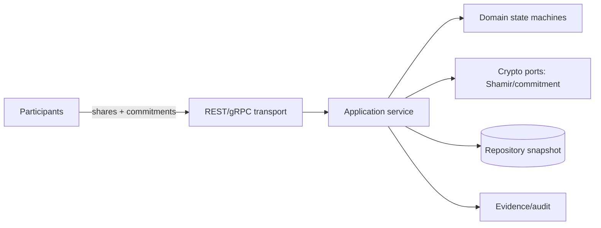

# MPC Coordinator

纯 Go 的多方安全计算任务协调服务。协调器只保存承诺、加密分片和结果证明，不记录参与方明文输入。默认使用可替换的内存仓储和模拟 KeyProvider，提供完整可启动的演示闭环。

## 核心能力

- Shamir `(t,n)` 秘密分享，有限域边界检查、拉格朗日阈值重构、SHA-256 承诺。
- computation/round 状态机、租约 fencing、重复分片拒绝、Idempotency-Key。
- 结果证明与 evidence 记录，可离线依据 computation、round、proof 摘要验证。
- `/api/v1` REST、OpenAPI 3、gRPC protobuf 契约、JSON 结构化日志、health/ready/metrics。
- JSON 快照持久化端口、Docker、Compose、Makefile 和 smoke 脚本。

## 快速运行

```bash
go test ./...
go vet ./...
go build ./...
MPC_STATE_FILE=./data/state.json go run ./cmd/mpc-coordinator
./scripts/smoke.sh
```

创建并重构一个演示任务：

```bash
curl -X POST localhost:8080/api/v1/computations -H 'Content-Type: application/json' \
  -H 'Idempotency-Key: demo-1' \
  -d '{"tenant_id":"acme","protocol":"sum","protocol_version":"1","threshold":2,"participant_count":3}'
curl -X POST localhost:8080/api/v1/computations/<id>/start
curl -X POST localhost:8080/api/v1/computations/<id>/demo-shares -d '{"round_id":"<round>","secret":"42"}'
```

生产环境应替换内存仓储、KeyProvider、TLS/认证和真实协议执行器；当前未实现能力必须在扩展端口返回明确错误。

## 架构



## 安全与运维

秘密值仅作为 API 请求体和有限域整数处理，禁止日志打印；超时、租约、阈值不足和重放均分类返回。`/healthz` 与 `/readyz` 可用于 Kubernetes 探针，`Dockerfile` 使用 distroless 运行时。
